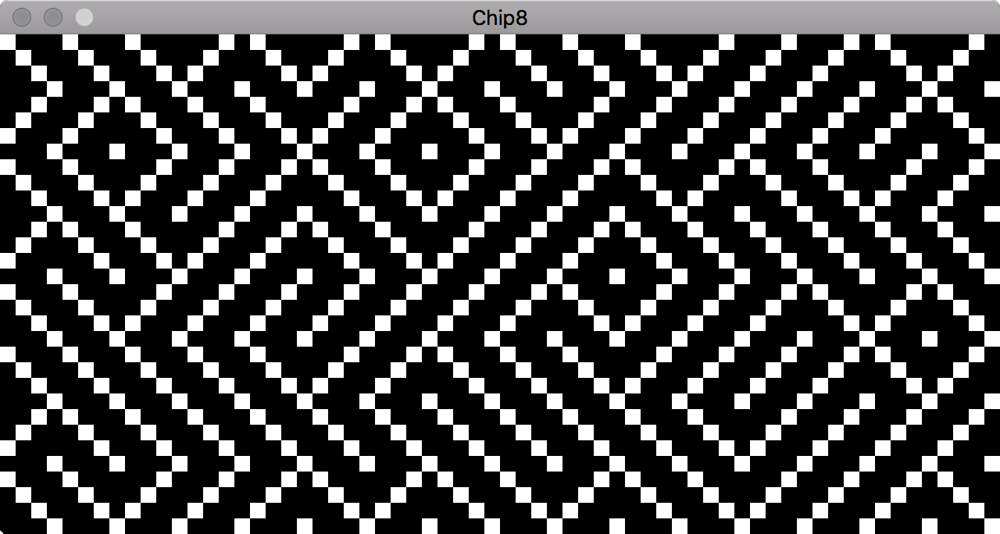

# chip-8

Cross platform CHIP-8 Emulator with SDL audio/video front-end.



## Build Dependencies

1. SDL2
    * [SDL2 website](https://www.libsdl.org/download-2.0.php)
    * Fedora package manager: ``sudo dnf install SDL2-devel``
    * Ubuntu pacakage manager: ``sudo apt install libsdl2-dev``
    * MacOSX brew: ``brew install sdl2``
    * MacOSX port: ``sudo port install libsdl2``
2. Rust Compiler
    * Install it with: ``curl https://sh.rustup.rs -sSf | sh``
3. sdl2 rust crate (automatically resolved by cargo at build)

## Build Instructions

After issuing the following commands, the executable can be found in ``targets/release``

```
git clone https://github.com/fabiocolacio/chip-8
cd chip-8
cargo build --release
```
